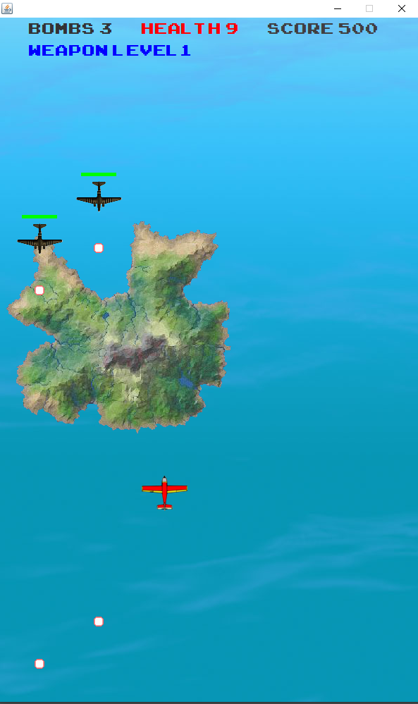
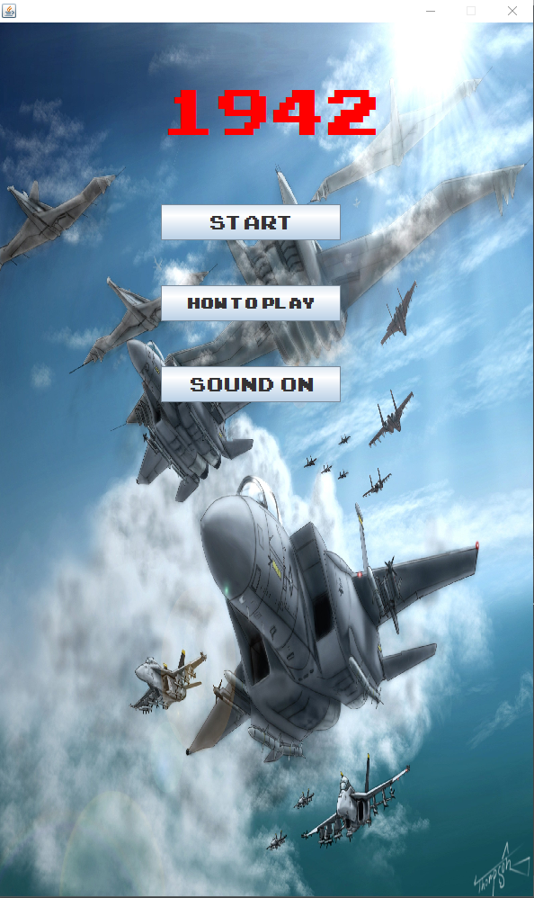

# 1942
A 2-d java based game designed to replicate the popular game of 1942

# Installation / How to Play
To play download the zip and extract contents into a Java project. To run the project, open your IDE and build the MainMenu.java file in thet src folder.

# Controls

**controls:** 
For Keyboard and mouse users, you wasd for keyboard movement and spacebar to shoot.
For mouse users use mouse movement for game movement and left mouse click to shoot and right mouse click to detonate grenades.

